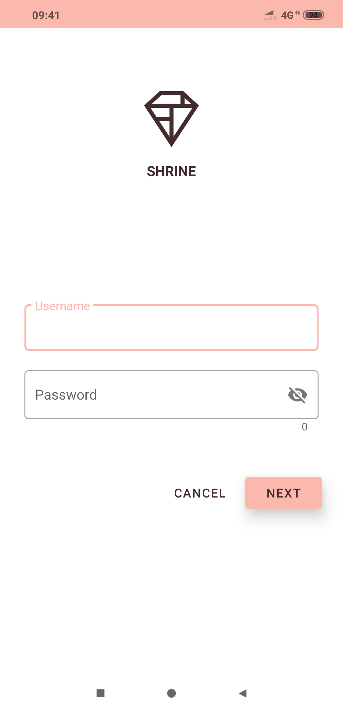
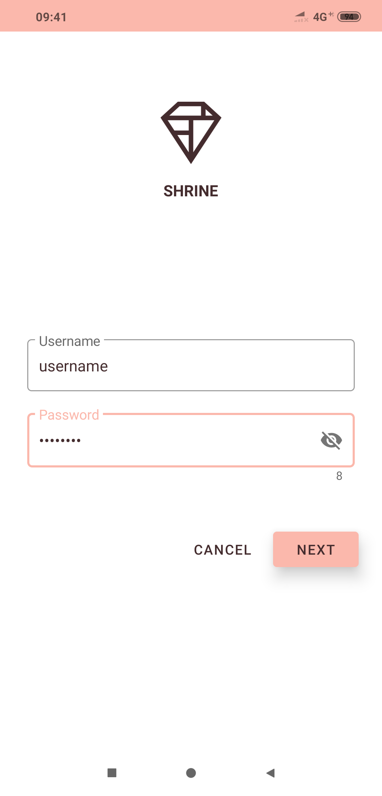
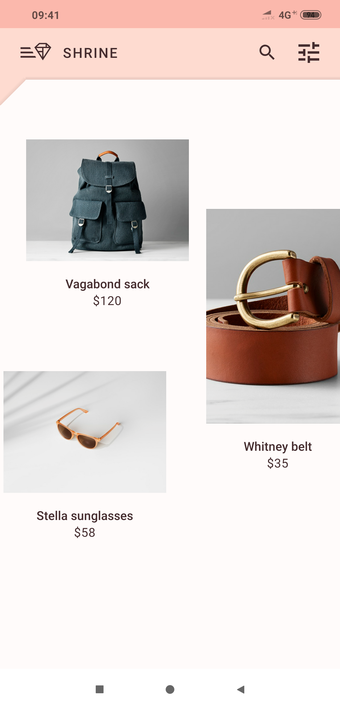
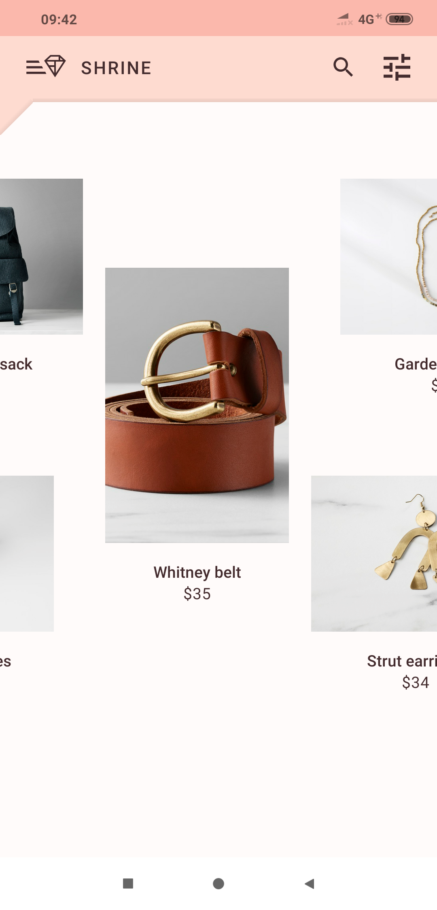
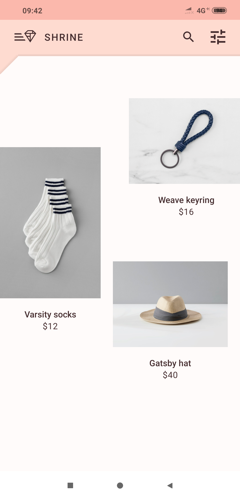
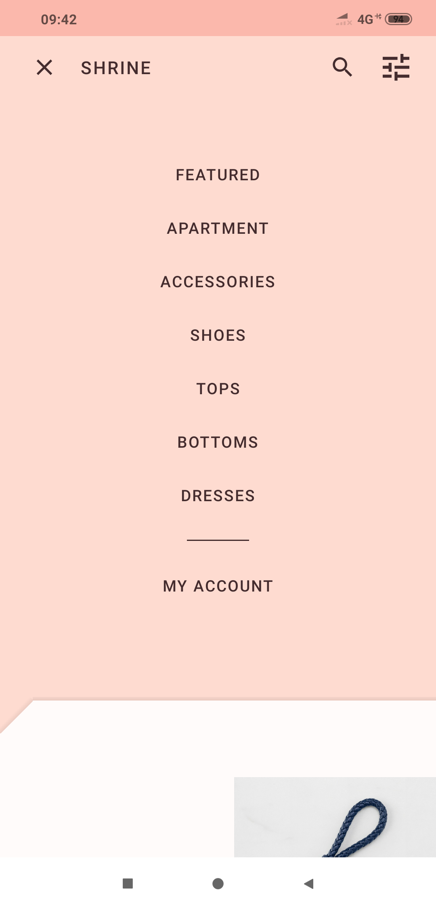
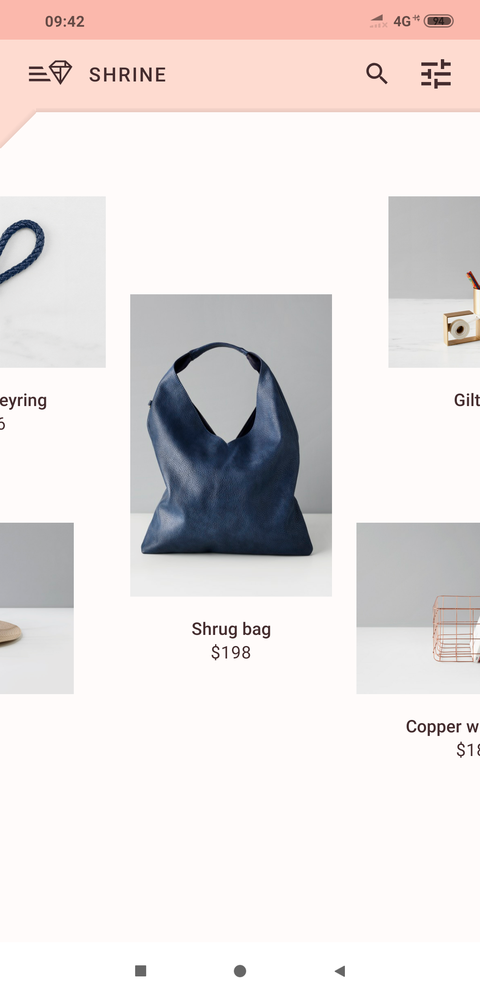

# Material_Design_Shrine
Material Design prototype of an E-commerce App Shrine.

Material Design Components Used:
1. TextFields
2. Button
3. AppBar
4. Icons
5. CardView
6. Staggered RecycleView
7. Animations

Below are ss of the app:

 

 

 

